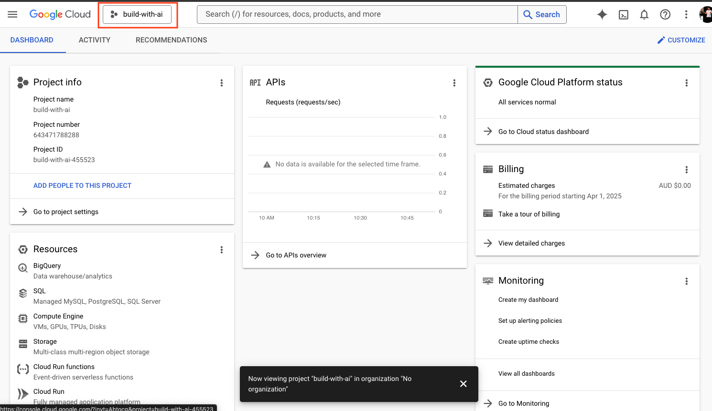
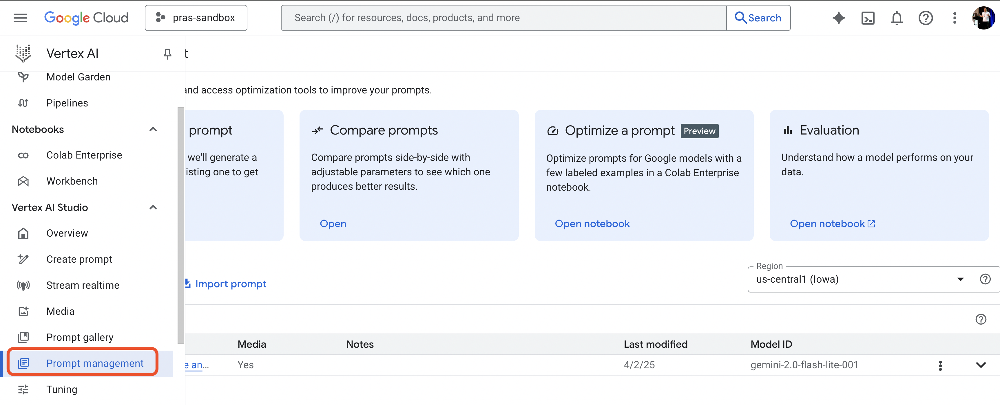
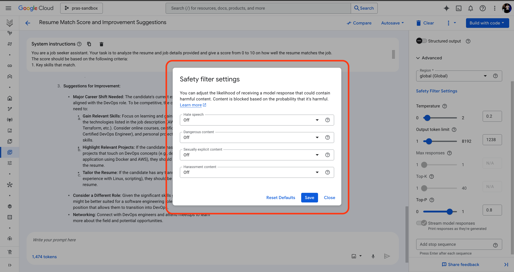
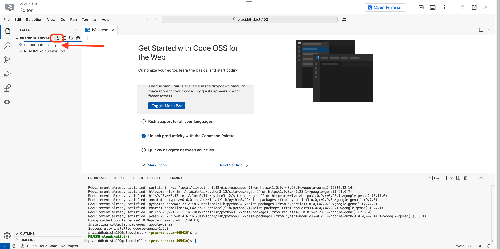
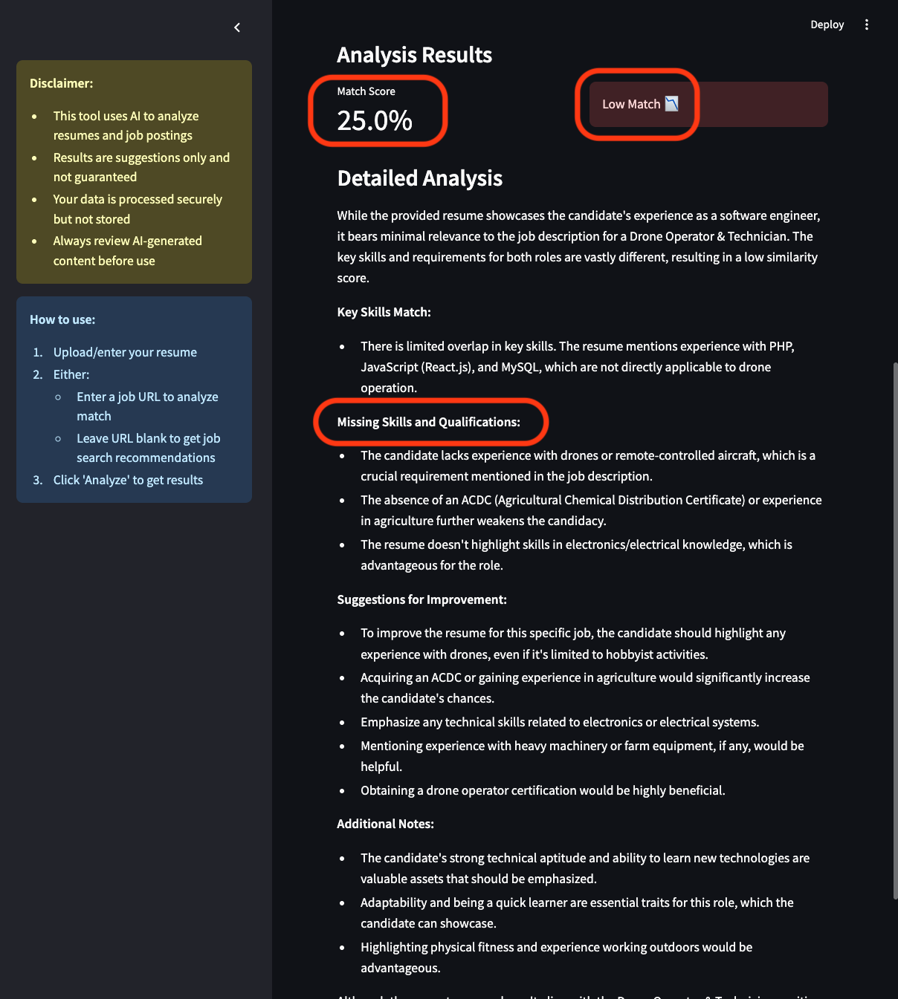

summary: Discover how Google Gemini can analyze resumes, match candidates with job postings, and recommend the best career opportunities
id: careermatch-ai-labs
tags: codelabs, google gemini, ai, cloud run, streamlit
title: CareerMatch AI: A Job Seeker Assistant Powered by Google Gemini
status: Published

# Discover how Google Gemini can analyze resumes, match candidates with job postings, and recommend the best career opportunities.


## Context

Welcome to the Google Build With AI event series!

In this hands-on workshop, we will explore how to leverage Google Gemini to create a powerful job seeker assistant. This session is designed for developers, data scientists, and anyone eager to harness AI to streamline workflows, unlock new possibilities, and drive innovation in their projects and everyday life.

### Gemini LLM
Gemini is a suite of advanced artificial intelligence models created by Google DeepMind. What sets it apart is its ability to understand and work with various forms of information, not just text. This means it can handle and combine things like images, sounds, videos, and code, in addition to written language. - [Source](https://deepmind.google/technologies/gemini/)

### Vertex AI
Vertex AI is Google Cloud's comprehensive platform designed to help developers and businesses build and deploy AI applications, especially those powered by generative AI. Access and utilize AI Studio, Agent Builder, and 160+ foundation models including Gemini 2.0 from Vertex AI. - [Source](https://cloud.google.com/vertex-ai?hl=en)

### A sneak peak into what you will be deploying to Google Cloud today
The application hosted in Google Cloud Run uses Streamlit for the front-end interface. Features include resume analysis, similarity scoring, and personalized job recommendations.


## Prerequisites
Before starting this workshop, ensure you have:

- A Google Cloud Platform account (for those who want to deploy their version) and credits will be provided, so a Google account will be enough.
- Basic understanding of Python and web applications
- Some familiarity with serverless cloud services like Google Cloud Run
- Interest in practical applications of generative AI

Note: Please be aware of the [Vertex AI Pricing](https://cloud.google.com/vertex-ai/generative-ai/pricing) as well.

## Exploring Vertex AI in Google Cloud Console

1. Sign in to [Google Cloud Console](https://console.cloud.google.com/) and create a [new project](https://console.cloud.google.com/projectcreate)


2. Ensure you have selected the project created in step 1 if you have multiple projects.


3. Navigate to Vertex AI from your Google Cloud Console. Search and click on `Vertex AI` from the search bar to find the page,


4. Enable required APIs for Vertex AI


5. Then, click on `Create Prompt` found on the Main menu on the left side of the page.


6. This is the page where you can create a prompt and test your application logic. You can choose from different models, including Gemini 2.0, and customize the prompt to suit your needs.

## Prompting Gemini 2.0

1. Ensure you have selected the `gemini-2.0-flash-lite-001` model. Then, paste the following prompt in the `Systems Instructions` box:
```markdown
You are a job seeker assistant. Your task is to analyze the resume and job details provided and give a score from 0 to 10 on how well the resume matches the job.
The score should be based on the following criteria:
1. Key skills that match.
2. Missing skills or qualifications.
3. Suggestions for improving the resume or get better qualifications to better match the job.
The score should be a number between 0 and 10, where 0 means little to no match and 10 means a perfect match.
```


2. Enter the job details and sample resume in the prompt section,
```markdown
JOB DETAILS:

DevOps Engineer / Site Reliability Engineer - Freelancer.com

Location: Sydney, NSW
Organization: Freelancer.com
Position: Full-time

About the Role:
As a key member of the Systems Engineering team, you'll work with software engineers to design and deliver mission-critical services. You'll manage large-scale infrastructure using cutting-edge technologies supporting the high-traffic Freelancer.com marketplace and other products deployed in AWS. The tech stack includes Nginx, MySQL, Redis, ElasticSearch, RabbitMQ, Consul, Docker, and Kubernetes. Your focus will be building resilient, scalable systems using Terraform, Puppet, Prometheus, Grafana, Kibana, and Jenkins.

Required Skills:
* Strong knowledge of OS, networking, and systems architecture
* Experience with Linux and production-scale database/web servers
* Cloud platform expertise (AWS, GCP, Azure, VMware, OpenStack)
* Container orchestration skills (Docker, Kubernetes, Docker Swarm, AWS ECS)
* Configuration management experience (Puppet, Chef, Ansible, CloudFormation, Terraform)
* Programming skills in Python, Go, PHP, Ruby, or Node.js
* Incident response capabilities and security mindset
* Preferred: CS/Engineering degree or equivalent

Benefits:
* Career growth opportunities in a meritocratic culture
* Weekly team lunches
* Fully stocked kitchen and office bar with harbour views
* Engaging town halls with open CEO Q&A
* Regular team events and hackathons
* Prime office location with wellness programs
* Global impact helping millions access work opportunities
* Internal promotion opportunities

Company Overview:
Freelancer.com owns Escrow.com ($6B+ in transactions) and Freightlancer & Loadshift (650M+ km in freight postings).

RESUME:
# Ram Ghale
**Location:** Sydney, Australia
**Contact:** +61 4xY 123 123
**Email:** Name@gmail.com
**Links:** LinkedIn | GitHub | Website

## Summary
Software engineer with 3 years of experience in full-stack web development. Specializes in building digital solutions using PHP, JavaScript (React.js), and MySQL. Passionate about creating scalable, user-focused products.

## Experience
### Software Engineer - Growcept.com
*Kathmandu, Nepal | April 2017 - June 2018*
- Developed and customized WordPress themes for XYZ marketplace and WordPress.org
- Rebuilt e-commerce portals using WooCommerce, implementing analytics tools (10% sales improvement)
- Standardized theme development process for improved consistency and scalability
- Implemented live commentary system for WicketNepal, increasing traffic by 20%
- Created efficient onboarding workflow using Docker, Git, and WP themes

### Backend Engineer - Intellisoft Nepal
*Kathmandu, Nepal | March 2016 - March 2017*
- Developed software products, databases, and API endpoints for enterprise clients
- Implemented Agile scrum methodology for faster feature releases
- Created office management system, improving efficiency by 40%
- Reduced application server costs by 25% through AWS S3 implementation

## Side Projects
- Musical chord progression generator (React.js)
- Node.js REST API for Australian tech companies offering work visas

## Education
**Bachelor of Engineering in Information Technology** (2017)
Nepal College of Information Technology - Pokhara University

## Additional Information
- **Work Rights:** Full-Time up to September 2025 (Masters Spouse Visa - 500)
- **Languages:** Nepali, English (IELTS 7 overall)
- **Volunteering:** Nepal Open Source Klub member - organized community events, taught Linux tools
```

4. Click on `Submit` to get the response from Gemini 2.0.


5. The response will include the score, key skills that match, missing skills or qualifications, and suggestions for improving the resume.


## Save the prompt
1. Click on the `Save` button to save the prompt for future use.


2. Enter a name for the prompt like `Resume Match Score and Improvement Suggestions` and click on `Save`.


3. All saved prompts will be accessible via [Prompt Management Page](https://console.cloud.google.com/vertex-ai/studio/saved-prompts?hl=en-AU)


4. Hurray! we have successfully created a prompt using Google Gemini 2.0 to analyze resumes and job details, providing a score and suggestions for improvement.

5. We will now explore different ways to enhance the performance of the model by fine-tuning the prompt. Click on the saved prompt to edit it.


## Fine-tuning the prompt

Next, we will fine-tune the prompt to improve the results. There are 3 advanced prompt settings you can configure to enhance the performance of the model. These settings are:
- **Temperature**: This setting controls the randomness of the model's output. A higher temperature value (e.g., 0.8) will make the output more creative and diverse, while a lower value (e.g., 0.2) will make it more focused and deterministic.
- **Output Token Limit**: This setting controls the maximum number of tokens (words) the model can generate in its response. A higher limit allows for longer responses, while a lower limit restricts the output length.
- **Top P**: This setting controls the diversity of the model's output by sampling from the top P percentage of the probability distribution. A higher value (e.g., 0.9) allows for more diverse outputs, while a lower value (e.g., 0.5) makes the output more focused on the most likely words.


Ensure safety filters are enabled to avoid any harmful content in the response. These settings are disabled by default.


You can also refine the prompt text to improve its effectiveness. Adjust it to be more flexible or specific based on your goals.

## Run the generate code

When we add a prompt to Vertex AI, it automatically generates a code snippet that can be used to call the model programmatically. This code can be run in a Python environment, such as Cloud Shell environment, Jupyter Notebook or Google Colab.

1. Click on the `Get Code` button to get the code snippet. We'll close this section for now and return to it later to retrieve the code snippet for calling the model.


2. Click `Activate Cloud Shell` toward the top right corner of the cloud console to open the Cloud Shell environment and editor so we can run the code snippet. You may need to also authorize Cloud Shell to access your Google Cloud resources.


3. Click on `Open Editor` to open the Cloud Shell editor.


4. In the Cloud Shell editor menu at the top, click on `Terminal` and select `New Terminal` to open a new terminal window in the editor.


5. In the terminal, run the command below to install the `google-genai` library, which is necessary for interacting with Vertex AI,
```bash
pip3 install --upgrade google-genai
```


6. From the left panel, click on the file `+` icon to create a new file. Name the file `careermatch-ai.py` or something relevant


7. Copy the code snippet from the `Get Code` section in Vertex AI Prompt page and paste it into the newly created file. This code snippet will call the model and provide the resume analysis and job matching functionality.


8. Save the file and run the code in the terminal using the following command:
```bash
python3 careermatch-ai.py
```


Congratulations! You have successfully created a job seeker assistant using Vertex AI. The application can analyze resumes, match candidates with job postings, and recommend the best career opportunities.

You can close the Cloud Shell Editor.

## Deploying the application to Google Cloud Run

1. Lets analyze the code for CareerMatch AI and deploy it to Google Cloud Run. The application is built using Streamlit, a popular framework for building web applications in Python


2. Once the user provides the resume file/text and job details, the application uses the `google-genai` library to call the Gemini model and get the analysis and matching score. The results are then displayed on the web page.
<!--  -->

3. To deploy the application on Google Cloud Run, navigate to the following [GitHub repository](https://github.com/boltdynamics/careermatch-ai) and click on the `Run on Google Cloud` button found in Readme,


4. This will redirect you to the Google Cloud Console, where you are required to trust the repository and authorize cloud shell


5. A cloud shell machine will be provisioned for you, and the code will be cloned into the cloud shell environment. Select the project you created earlier and click on `Continue` to proceed.


6. The process will enable Cloud Run APIs on the project. Select `us-central1` for the region.


7. The process will build a Docker image for the application, upload it to Artifact Registry and deploy it to Google Cloud Run service. This may take a few minutes.


8. Congratulations! The application has been successfully deployed to Google Cloud Run. You can access the application using the URL provided in the terminal


9. Lets try out the application by uploading a resume and job details. Download this [sample resume](https://docs.google.com/document/d/19ZxyQ4WVJzMsXTL2kL4s6Lb9-4ESfEYTldxOUQZtzdo/edit?usp=sharing) in PDF format.


10. Click on `Browse Files` to upload the resume file. The resume highlights experience in Wordpress Development and Backend Engineering. Paste this job post [link](https://www.seek.com.au/job/83083901?ref=search-standalone&type=standard&origin=jobTitle#sol=4c9d22cd936a48d098459d9d60a13dbb7a6ad80d) in the `Enter job posting URL` section and click on `Analyze` to get the analysis and matching score.


11. We can see that the resume matches the job posting for Wordpress Specialist at Sj Personnel. The application provides a 75% match score, indicating that the resume aligns well with the job requirements. It also suggests some improvements to the resume, such as adding more details about their past experience and skills related to the job posting.


12. Now lets try out a different job posting that is very different from the resume. Paste this job post [link](https://www.seek.com.au/job/82809251?ref=search-standalone&type=promoted&origin=jobTitle#sol=2b9aceb19b46620aeafdc3f45f8aa72596440966) in the `Enter job posting URL` section and click on `Analyze` to get the analysis and matching score.

13. We can see that the resume does not match the job posting for a Drone Operator. Software engineering and drone operation are two very different fields and as a result, the application provides a 25% match score, indicating that the resume does not align well with the job requirements.


14. You can also leave the job posting URL section empty and click on `Analyze` to get the analysis on a broad level. Gemini uses grounding feature to leverage Google search and suggest best ways to find relevant job postings. The application provides a list of job boards and websites where the user can find job postings related to their skills and experience.


15. You can also try out different job postings and resumes to see how well the application performs.

Congratulations! You have successfully deployed a job seeker assistant application using Google Gemini and Streamlit on Google Cloud Run. The application can analyze resumes, match candidates with job postings, and recommend the best career opportunities.

## Run out of Credit?

Even after your Google Cloud credits expire, the fun doesn’t stop — keep experimenting and generating code with [Google AI Studio](https://aistudio.google.com/).

Google AI Studio, including Gemini Pro and Gemini Pro Vision, is currently free to use, and there are no charges for Google AI Studio usage, regardless of whether you set up billing for the Gemini API.


NOTE: While currently free, there may be future charges for using Google AI Studio service, but this is not yet in effect.

## Conclusion

In this workshop, we explored how to leverage Google Gemini to create a powerful job seeker assistant. We learned how to create and fine-tune prompts in Vertex AI, deploy the application to Google Cloud Run, and analyze resumes and job postings.

We also discussed the importance of using advanced prompt settings to enhance the performance of the model and how to deploy the application on Google Cloud Run. Responsible AI practices were also emphasized throughout the workshop.

We hope you found this workshop informative and valuable. If you have any questions or feedback, please feel free to reach out.
